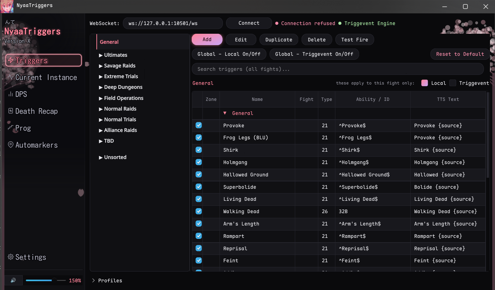

# NyaaTriggers

An FFXIV trigger manager that connects to [IINACT](https://github.com/marzent/IINACT) for spoken callouts, live DPS, death recaps, and prog sessions. Party automarkers use the Telesto plugin. English and Japanese are supported. Request other languages through an issue.



**Platform:** Linux · Windows  ·  **[Full guide](docs/GUIDE.md)**  ·  [Changelog](CHANGELOG.md)  ·  [Discord](https://discord.com/invite/TQJrbZcgKF)

[Installation](#installation) · [Connection](#connecting-to-iinact) · [Callouts](#choosing-callouts) · [Triggernometry](#triggernometry-packs) · [DPS and prog](#dps-death-recaps-and-prog) · [Profiles](#profiles) · [Updating](#updating-and-saved-data) · [Troubleshooting](#troubleshooting-callouts)

---

## Installation

### Windows

Download `NyaaTriggers-windows.zip` from the [latest release](https://github.com/CateDesu/NyaaTriggers/releases/latest), extract the whole folder somewhere writable, and run `NyaaTriggers.exe` inside it. Keep the `_internal` folder beside the executable.

Release builds include Python, the English Piper voice, cactbot's browser runtime, and the Triggevent and Triggernometry engines. Java is bundled for Triggevent. Triggernometry uses Windows' .NET Framework, so it needs no Mono installation.

### Linux packaged build

Download `NyaaTriggers-linux.tar.gz` from the [latest release](https://github.com/CateDesu/NyaaTriggers/releases/latest) and extract it somewhere writable:

```bash
tar -xzf NyaaTriggers-linux.tar.gz
cd NyaaTriggers
./NyaaTriggers.sh
```

Use `NyaaTriggers.sh` for shortcuts too. The launcher can recover a missing runtime folder after an interrupted update. Python, the English Piper voice, cactbot's browser runtime, and Triggevent's Java runtime are bundled.

### Linux system dependencies

Neural voices and alert sounds need `aplay` from `alsa-utils`, including in the packaged build. Install it in the same environment where you launch NyaaTriggers. The commands below include it alongside the engine dependencies.

Triggernometry needs a system Mono installation, including Windows Forms, for both packaged and source runs. Xvfb lets both engines run their hidden interfaces on a virtual display. Without Xvfb they use your session's X display.

Arch / CachyOS, using the distribution's [Mono package](https://archlinux.org/packages/extra/x86_64/mono/):

```bash
sudo pacman -S --needed alsa-utils mono xorg-server-xvfb xorg-xauth
```

Debian / Ubuntu, using [Mono development packages](https://packages.ubuntu.com/noble/mono-devel):

```bash
sudo apt update
sudo apt install alsa-utils mono-devel libmono-system-windows-forms4.0-cil libgdiplus xvfb xauth
```

Fedora, using [alsa-utils](https://packages.fedoraproject.org/pkgs/alsa-utils/alsa-utils/) for audio and [mono-complete](https://packages.fedoraproject.org/pkgs/mono/mono-complete/) to include Windows Forms:

```bash
sudo dnf install alsa-utils mono-complete xorg-x11-server-Xvfb xorg-x11-xauth
```

On Bazzite, install those Fedora packages inside a `distrobox` or `toolbox` and launch NyaaTriggers there, or layer them with `rpm-ostree install` and reboot.

### Linux from source

Use Python 3.11 or newer. On Arch, CachyOS, Debian, or Ubuntu:

```bash
git clone https://github.com/CateDesu/NyaaTriggers
cd NyaaTriggers
bash setup.sh
python3 main.py
```

`setup.sh` installs PyQt6, WebSocket support, regex, and `aplay` through pacman or apt. First launch downloads the English voice and installs Piper into `~/.venv/ffxiv`.

Optional engines need their own dependencies:

| Engine | Source setup |
|---|---|
| Triggevent | Install Java 17, then use **Settings - Program - Update Triggevent Engine** to download the prebuilt engine on a fresh checkout. Building it yourself needs JDK 17 and Maven. See the [engine instructions](triggevent-core/README.md#build-from-source-developers-only). |
| Triggernometry | Install the [Linux system dependencies](#linux-system-dependencies). The prebuilt engine is already included in the checkout. |
| Cactbot | Install PyQt6-WebEngine and restart. On Arch / CachyOS: `sudo pacman -S python-pyqt6-webengine`. For a pip environment: `python3 -m pip install -r requirements.txt`. |

Source runs can use the prebuilt engines. Program code is in `nyaatriggers/`, interface code in `nyaatriggers/ui/`, and the entry point is `main.py`.

## Connecting to IINACT

1. Install and enable IINACT in Dalamud using its [installation guide](https://www.iinact.com/installation/), then log into your character.
2. In NyaaTriggers, set **WebSocket** to `ws://127.0.0.1:10501/ws`, or your configured IINACT address, and press **Connect**.
3. Open **Current Instance** to check that the zone and combat log are arriving. **My character** in **Settings - Connection** fills automatically and can be corrected there.
4. Enable **Auto-connect on startup** in that same section if wanted. After connecting, the program retries a lost connection automatically.

The IINACT connection supplies the combat feed. Telesto and the companion overlay have their own connections, described below.

## Choosing callouts

The **Triggers** tab groups fights by content type and expansion. Search spans all fights. Expand a source group and use its row checkboxes to choose callouts.

| Source | What it runs | Controls |
|---|---|---|
| Local | Bundled and custom triggers, status reminders, and follow-up sequences | Edit abilities, zones, speech, sounds, and timing. |
| Triggevent | Built-in callouts, EasyTriggers, user Groovy scripts, and custom sequences | Toggle callouts, edit speech, or build custom sequences with conditions. |
| Triggernometry | Native XML packs with conditions and scripts | Create and edit packs, toggle speech, and change wording. See [pack support](#triggernometry-packs). |
| Cactbot | Raidboss callouts and timelines | Enable in **Settings - Cactbot** and mute individual callouts. |

Engine callouts start enabled, including newly discovered ones. Local rows retain their saved choices. **Global - Local On/Off** and **Global - Triggevent On/Off** affect all fights. Global Local also controls local timelines. The **Local** and **Triggevent** checkboxes above the table affect only the selected fight's rows. Overlapping sources can produce duplicate calls.

Enabling Cactbot switches off Local, Triggevent, and Triggernometry callouts and selects cactbot timelines. Dungeon timelines are bundled; others download and cache as needed. Turning Cactbot off restores editable callouts and local timelines.

Right-click a **Current Instance** log line to create a trigger, or a fight tree entry to create a folder. **Test Fire** previews a row. The toolbar's **Reset to Default** clears checkmarks. A bundled row's right-click **Reset to Default** restores that trigger's values. See the [editor guide](docs/GUIDE.md#triggers-tab).

**Add - Triggevent callout** opens a visual builder for event waits, delays, and conditional speech. Search for a fight to fill its zone automatically, or leave it unassigned to save under Unsorted. It can remember an earlier debuff and use it to choose a later callout. See [custom Triggevent callouts](docs/GUIDE.md#custom-triggevent-callouts).

## Triggernometry packs

Choose **Settings - Data - Import Triggernometry** to load an XML export, such as a [Paissa pack](https://github.com/paissaheavyindustries/Triggernometry-Triggers/tree/main/Repositories). Imported triggers appear under **Triggernometry** in the fight list.

Use **Triggers - Add - Triggernometry trigger** to create a pack, or **Add - Edit Triggernometry pack** to edit one. The editor supports nested conditions, variables, delays, trigger chains, and C# scripts. Saves validate native XML and regex syntax, keep a backup, and wait until combat ends before reloading the engine. See the [editor guide](docs/GUIDE.md#triggernometry-engine-wip).

Imports always add a copy, even with the same filename. To update or remove a pack, close the program, replace or move its XML in the [pack folder](#updating-and-saved-data), then restart.

The engine supports conditions, shared variables, delayed actions, trigger chains, and C# scripts. Without the engine, only simple ability matches with plain speech convert to Local rows.

Packs can use Telesto memory notifications and drawings through the **Telesto URL** in **Automarkers**. Commands and macros also require **Enable automarkers**. Legacy Triggernometry auras, direct memory access from C# scripts, and ACT combat-state or encounter-duration hooks are unsupported. Replay checks cover selected TOP and Zelenia mechanics; live validation is pending. See [compatibility and setup](docs/GUIDE.md#triggernometry-engine-wip).

## DPS, death recaps, and prog

| Tab | What it records |
|---|---|
| **DPS** | Live DPS, damage share, HPS, crit and direct hit rates, max hit, and deaths. Pets merge into their owners. **Recent pulls** reviews attempts from the current run. |
| **Death Recap** | Observed damage, healing, and statuses in the 15 seconds before a death. The latest 80 deaths remain available until the program closes. |
| **Prog** | Saved duty sessions with pull durations, endings, deaths, a chart, bookmarks, notes, and death recaps. |

The meter runs whenever the combat feed is connected. **Record encounters**, off by default, saves full pull summaries to `dps_logs/`, retaining five completed logs plus the active log. **Reset display after** affects only the live display.

In Prog, **Start session** begins collection once the duty and combat state are known. Starting during combat waits for the next full pull. **End session** or leaving the duty ends collection; wipes and breaks stay in the session. Interrupted attempts are listed separately. **Combat ended** does not mean a clear.

Notes and death recaps save automatically, independently of DPS recording and log rotation. Select a pull and choose **View death recaps** to review it, including after restart. Recaps cannot reconstruct exact HP or events missed before connection. UMAD phases are confirmed by boss casts and ability events. Older pulls without phase data remain **Not recorded**. See the [Prog guide](docs/GUIDE.md#prog-tab) for recording and recovery details.

**Settings - FFLogs** can show your best recorded rDPS after a fight using your personal API client details, server, and region. **IINACT Logs** opens the raw logs for an FFLogs uploader. DPS summaries are separate files.

## Profiles

Expand **Profiles** below the trigger list to save setups for jobs, groups, or strategies. **Save new** captures trigger checkmarks and spoken text. **Apply** activates a selected profile between pulls. **Update** replaces its saved snapshot with your current choices.

Apply **Default** to restore your normal setup. The active profile and Default survive restarts. Selecting or saving a profile does not activate it, and later edits reach its snapshot only through **Update**. Deleting the active profile restores Default between pulls. Profiles preserve trigger definitions and leave voice, Cactbot mode, and automarkers unchanged. See [profile controls](docs/GUIDE.md#profiles).

## Voice and language

Choose **System** or **Piper** in **Settings - Voice** and check playback with **Test TTS**. Windows defaults to System; Linux defaults to offline Piper. Japanese neural voices Alpha and Kumo download on first selection. Add Piper models with their matching `.onnx.json` files through **Open voices folder**.

**Settings - Program - Language** offers Automatic, English, and 日本語 and applies after restart. Japanese callout translations fall back to English where unavailable. **Settings - Alert Sound** has built-in sounds, volume controls, and **Import SFX** for `.wav` files.

The sidebar slider controls audio from 0% to 200%. Click its speaker to mute, or right-click for timed and zone-based mute options. Recordings and visual callouts continue while muted. See the [voice guide](docs/GUIDE.md#voice).

## In-game display and automarkers

The optional [NyaaTriggers Overlay](https://github.com/CateDesu/NyaaTriggers-Overlay) Dalamud plugin draws timeline bars, callouts, and DPS inside the game. Follow its README to install, then use `/nyaa` to position and lock the windows. **Settings - In-Game Overlay** shows connection status. The link connects automatically when ports match. Speech works without it.

Automarkers use [Telesto](https://github.com/paissaheavyindustries/Telesto). Set **Telesto URL**, use **Test mark (on me)**, then enable marking. Rules mark you or the party member with a debuff. Unassigned rules place no mark.

**Load UMAD preset** adds Dancing Mad Ultimate debuff rules. Assign signs for your strategy. The tab also provides P3 black-hole cleanse queues, P4 Cursed Shriek gaze pairs, automatic removal on debuff loss, and **Clear all party marks**. See the [automarker guide](docs/GUIDE.md#automarkers-tab).

## Updating and saved data

Use **Settings - Program - Check for Updates**, or leave the startup check enabled. The update banner offers installation when a new release is available. Packaged builds replace the program files and restart while preserving saved data. Git checkouts pull main and check Python requirements. After published commits are combined, clean checkouts can follow the rewritten history with a saved Git backup. Local commits and tracked edits require manual resolution. Writable Python environments install them; distribution-managed Python reports missing packages for manual installation. A source copy without Git opens the download page instead. See [Updating](docs/GUIDE.md#updating) for installation details.

**Settings - Data - Update Triggers** refreshes the bundled trigger set without replacing your custom triggers. **Restore from Repo** downloads that set again if it needs repair. **Export Triggers** and **Import Triggers** transfer local definitions and folders; importing replaces the current local set. Profiles are saved separately.

Most writable data lives beside `main.py` for source runs or beside the executable for packaged builds:

| File or folder | Contents |
|---|---|
| `nyaatriggers_settings.json` | Connection, voice, language, engine callout choices, and other settings |
| `triggers.local.json` | Custom triggers, edited bundled triggers, folders, and saved overrides |
| `triggevent.custom.json` | Definitions created with the Triggevent callout builder |
| `trigger_profiles/` | Named profiles and the separate Default setup |
| `dps_logs/` | Recorded DPS pull summaries |
| `prog_sessions/` | Saved sessions, notes, and per-pull deaths under `recaps/` |
| `pull_logs/` | Optional raw captures for engine replay |
| `nyaatriggers.log` | Program diagnostics, including dropped-callout and crash entries |
| `nyaatriggers-update.log` | Windows update and rollback diagnostics when an update runs |
| `voices/`, `sounds/`, `timelines/` | User voices, imported sounds, and local timelines |

Imported Triggernometry packs and engine diagnostics use the per-user configuration folder instead: `~/.config/nyaatriggers/` on Linux, or `%APPDATA%\nyaatriggers\` on Windows. Linux respects `XDG_CONFIG_HOME`. Packs live under `triggernometry-packs/`; logs are `triggevent.log` and `triggernometry-core/triggernometry.log`. Include this folder as well as the program's writable data when moving your setup.

If you use existing Triggevent EasyTriggers or Groovy scripts, keep your Triggevent user folder too, normally `~/.triggevent/`.

---

## Documentation

The [full guide](docs/GUIDE.md) covers all controls and settings. Developer and planning references:

- [Triggevent engine](triggevent-core/README.md)
- [Triggernometry engine](triggernometry-core/README.md)
- [Tests](tests/README.md)
- [Planned work](docs/TODO.md)

## Troubleshooting callouts

Check the connection, selected fight's row checkboxes, Cactbot mode, and sidebar mute first. **Test TTS** checks the voice path, while **Test Fire** previews a row without validating that a mechanic will match it.

The engine indicator beside the connection turns red if an engine fails to start or stops unexpectedly. Hover it for the full message. An amber **chain failures** count means Triggevent reported failed callout sequences, even if the engine is still running. Its tooltip shows recent errors.

**Settings - Data - Save log…** exports the captured combat feed. **Settings - Connection - Record pulls to pull_logs for engine replay** can capture future attempts for replay. Program and engine diagnostic logs are listed under [saved data](#updating-and-saved-data). Their `.1` files keep the previous rotation when present. Include the program version, fight, missing callout, approximate time, and relevant logs when opening an [issue](https://github.com/CateDesu/NyaaTriggers/issues) or asking in [Discord](https://discord.com/invite/TQJrbZcgKF).

---

## License

MIT. Bundled engines and dependencies retain their own licenses.
